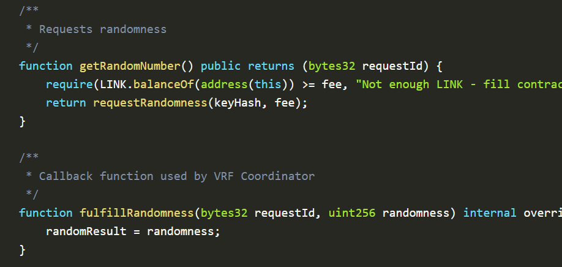

# 14.02.2022

Shufan

## Finished

- Crypto Zombie part 1, part2

## Notes

1. _name variables should be stored in memory for all reference types: arrays, structs, mappings, strings.
2. view: not changing any status, only query local eth node, still cost gas if not called externally.
3. pure: not access any state data. pure and view can be called free of gas.
4. internal: like private, accessible from inheritance.
5. the default visibility of a state variable is internal: accessible within inheritance.
6. self destruct: the only way to remove the code at an address from the blockchain.
7. difference between require & assert: require will refund the rest of the gas while assert will not.
8. uint = uint256. Only in struct we should think about saving storage as packing is applied to the struct. And put the same type of data together in a struct.
9. modifier: like ownerOf, can take args, is attached to definition of function definition. Usually contain require statements before the execution of a function.
10. chainlink data feeds: retrieve outside infomation to smart contracts like latest asset price. The decentralized oracle network contributes to each data feed. The data from each oracle is validated and aggregated by a smart contract.
    1.  deviation threshold: a new aggregation round starts when off-chain price deviate over threshold is observed by any node.
    2.  heartbeat threshold: a new agg starts after a certain interval.
    3.  aggregators are the contracts receive periodic data updates from multiple oracles.

## Questions

- In fulfillRandomness, why the input parameter: requestId is unused?

- 

